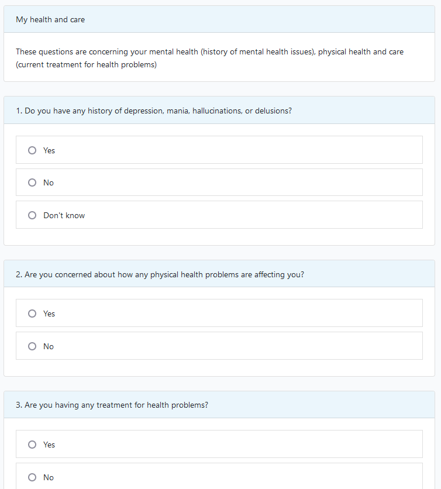
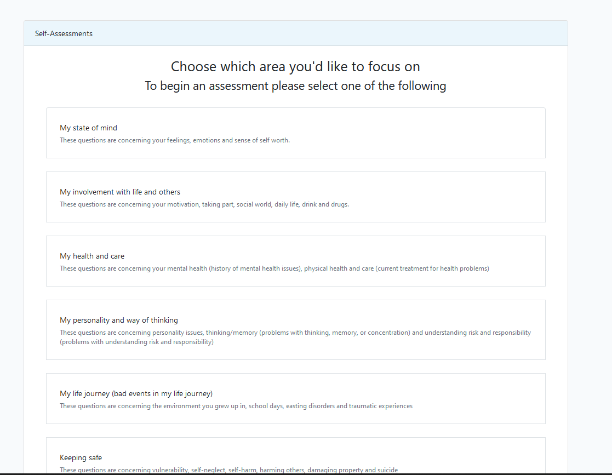
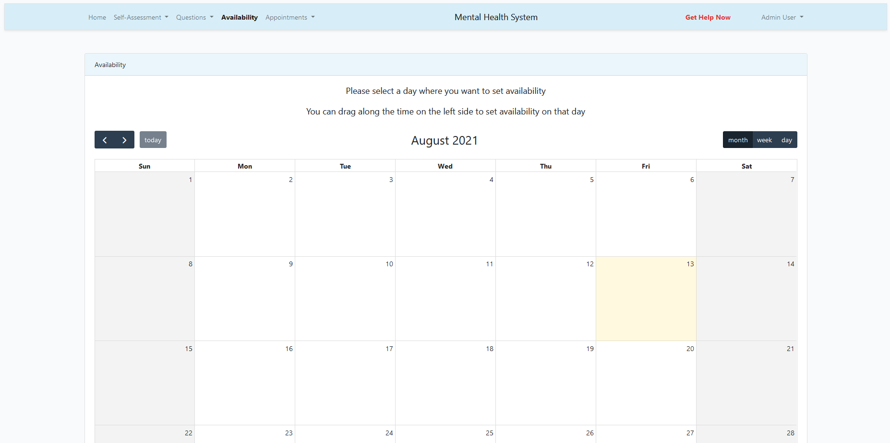
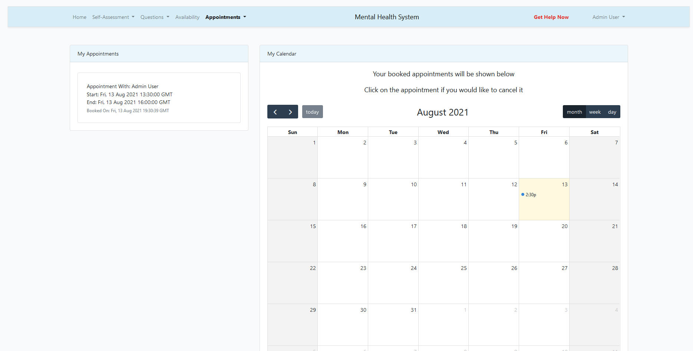

# Mental Health System

*README still in progress

## About Mental Health System

As part of my final year project dissertation, I embarked on a quest to research students mental health and develop a system which allows users to complete a self-assessment concerning areas of their mental wellbeing. As well as a student user having the ability to book appointments with mental health counsellors at university.
By default, the question bank is seeded with the original questions and corresponding answers from [GRiST, Galatean Risk and Safety Technology](https://www.egrist.org), which in its own right is a web-based decision support system designed to help practitioners assess and manage risks associated with mental health problems, including suicide, self-harm, self-neglect, vulnerability, and harm to others. 

## Functionality

- Users can complete a self-assessment concerning areas of their mental wellbeing
- Users can view their previous self-assessments
- Counsellor users can create question categories, add questions to them along with their corresponding answer choices
- Counsellor users can submit their available time slots on a calendar
- Users can select available time slots to book an appointment with a counsellor

## Tech Stack / Development
- Laravel
- Sail
- WSL2 + Ubuntu
- FullCalendar
- AJAX

To deploy the application you can simply use `sail up`
Sail allows for interaction with Laravel's default Docker development environment. Providing PHP, MySQL and Redis out of the box.

## Testing
- Laravel Dusk Browser Automation Testing  

To run the Laravel Dusk test suite use `sail dusk`

- Behaviour Driven Development/Test Driven Development

To run the unit tests with PHPUnit, simply use `sail artisan test`

// More tests are being developed

## More on GRiST

It has been developed by cognitive and computer scientists at Aston University over a period of 17 years and has recently been spun out into its own company, eGRiST Ltd. GRiST integrates patient data, mental-health practitioners expertise and empirical evidence to support comprehensive clinical risk evaluations, risk formulations, and safety plans. Machine learning provides predictions that are compared with the clinician’s own judgement to provide real-time benchmarking against data from thousands of colleagues. GRiST has been adopted by a number of secondary and community mental-health Trusts, charities, and private organisation. As of May 2018, it held over 1.5 million individual risk judgements in 380,000 completed assessments from 160,000 patients. At present, GRiST provides assessments covering the complete care pathway, from screening to full assessments, focused repeat assessments, and specialist versions for forensic services and learning disabilities. The self-assessment version, myGRiST, gives access to risk predictions and advice for the general public with output reports that can be linked with mental-health providers. GRiST can help Trusts understand how clinicians make risk judgements, compare these judgements to the expert knowledge held within GRiST and feed these learnings back into the system. Trials have also shown that the system can enrich the risk assessment process by flagging important behavioural cues that practitioners might have not considered incorporating into a risk assessment. In general, the GRiST data provide a valuable resource for researchers to increase understanding of how risks are identified and managed to improve people’s mental health, safety, and well-being. The GRiST team is always looking to work with people and organisations using GRiST, not only to enhance GRiST but also to help increase overall understanding of mental health and service provision.

## Screenshots of Application

